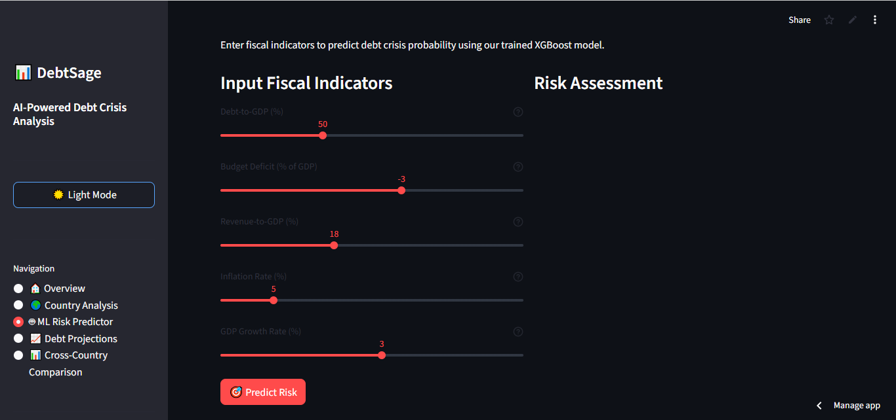

# Hi! I'm Akeem Jr 👋

  

**AI Innovator | Building Tech That Solves Real Problems | Engineering Student**

---

## 🚀 About Me

I'm an innovator passionate about building practical systems that solve real-world problems, especially at the intersection of **AI, embedded systems, and everyday life**.

I've built innovative systems using **AI agents, computer vision, generative AI, and machine learning** to turn ideas into solutions people can actually use, focusing on **real impact, not just demos**.

Currently building AI startups and always open to collaborate on exciting projects in **tech, startups, or community initiatives**.

---

## 💡 What I'm Building

### 🎯 Current Focus
- 🤖 Building an **Agentic AI startup**
- ⚡ Building TechPulze
- 🌍 Creating AI solutions tailored for the **Nigerian/African context**
- 🔧 Developing systems that bridge the gap between **cutting-edge AI and practical accessibility**

---

## 🛠️ Featured Projects

### 🎤 [Tawk - Voice Cloning System](https://github.com/Techdee1/Tawk)
> **Voice cloning tuned for Nigerian accents**

Built a voice cloning pipeline that captures Nigerian accents with just ~15 seconds of audio. Developed using FastAPI, with proper word-to-audio timing for coherent, natural speech.

**Tech Stack:** FastAPI, TTS Models, Audio Processing  
**Key Achievement:** Single-sample voice cloning with proper temporal alignment

---

### 🏥 [MedAssist - Multilingual AI Healthcare Agent](https://github.com/Techdee/MedAssist)
> **Automating patient intake in English, Yoruba, Hausa, and Igbo**

An AI agent that automates patient intake, schedules appointments, sends reminders, and routes information to clinic dashboards. Works via WhatsApp — no new app required.

**Tech Stack:** AI Agents, WhatsApp API, Python  
**Impact:** Reduces no-shows, shortens queues, improves patient experience  
**Demo:** [Watch Demo](https://lnkd.in/dw6C4twb)

---

### 🌊 [FloodGuard Nigeria - Flood Prediction System](https://github.com/Techdee1/Guardy)
> **Early warning system for Nigerian communities**

AI-powered flood prediction combining satellite rainfall data (CHIRPS), ERA5 climate data, and crowdsourced reports to deliver localized, actionable alerts hours before flooding occurs.

https://github.com/Techdee1/Techdee1/assets/FloodGuard%20Nigeria%20Alert%20System%20MVP%20-%20Google%20Chrome%202025-12-13%2014-36-47.mp4

**Tech Stack:** Machine Learning, Python, CHIRPS, ERA5 Climate Data  
**Impact:** Predicts flood probability 6+ hours ahead for affected communities  
**Dataset:** 2010–2024 Nigerian flood and climate data

---

### 💰 [DebtSage - Sovereign Debt Distress Predictor](https://github.com/Techdee1/DebtSage)
> **Predicting fiscal crises before they happen**

AI platform predicting sovereign debt distress using 60+ years of African fiscal data. Ensemble ML approach achieving 93.4% AUC-ROC in identifying debt distress risk.

**Tech Stack:** XGBoost, Random Forest, Logistic Regression, Python  
**Data:** 14 African countries, 41 engineered fiscal features  
**Key Insight:** Revenue stability explains ~50% of debt crisis risk

---

### 🚦 [Lagos Traffic Analysis System](https://github.com/Techdee1/Lagos_Traffic_AI_System)
> **Computer vision for Lagos-specific vehicles**

Real-time traffic analysis detecting and classifying Lagos vehicles: okada, danfo, BRT, keke napep, trucks, and private cars. Tracks vehicles across frames with unique counting.

https://github.com/Techdee1/Techdee1/assets/lagos%20traffic%20system.mp4

**Tech Stack:** Computer Vision, YOLOv8, OpenCV, Python  
**Features:** Real-time detection, vehicle tracking, traffic metrics dashboard

---

### 📹 [Smart Security Surveillance System](https://github.com/Techdee1/security_surveillance)
> **AI that watches, learns, and alerts in real-time**

Security system with real-time person detection, behavioral pattern learning, tamper detection, zone-based monitoring, and automatic event recording.

https://github.com/Techdee1/Techdee1/assets/security_surveillance%20vid%201.mp4

**Tech Stack:** YOLOv8n, OpenCV, FastAPI, WebSockets, SQLite  
**Features:** Privacy-first, local processing, low latency, live dashboard

---

### 🌾 [Crop Disease Detection Model](https://github.com/Techdee1/AI-CropDiseases-Detection-Model)
> **Making expert diagnosis accessible via SMS**

Helps farmers detect crop diseases through SMS and lightweight web app, accessible even without internet. Model trained on PlantVillage dataset.

**Tech Stack:** PyTorch, TensorFlow Lite, Computer Vision  
**Impact:** Brings AI-powered diagnosis to areas with limited connectivity

---

### 💊 [Healthmate AI - Multilingual Health Guidance](https://github.com/Techdee1/CJID-HACKATHON-Healthmate-AI)
> **Reliable health guidance in Nigerian languages**

AI-powered web solution providing basic health guidance in multiple Nigerian languages with backend AI integration.

https://github.com/Techdee1/Techdee1/assets/Healthmate%20AI%20video%20demo.mp4

**Tech Stack:** Flask, Azure, OpenAI API, REST APIs  
**Languages:** English + Nigerian languages

---

## 🧰 Skills

### **Technical Skills**

- **Programming:** Python, C, C++, TypeScript
- **Frameworks:** FastAPI, PyTorch, Tensorflow, Flask, OpenCV, Numpy, Langraph, LangChain
- **Cloud & DevOps:** Azure, Git/GitHub, Docker

### **Domains**
- 🤖 **Artificial   Intelligence (AI)** | Machine Learning | Agentic AI | Computer Vision | Deep Learning | Generative AI | Data Science
- - 💻 **Software Engineering**
- 🔌 **Embedded Systems** | Hardware Engineering | Electronics Engineering

### **Soft Skills**
- 🤝 Teamwork & Collaboration
- 💬 Communication
- 👥 Leadership & Team Management
- 🌍 Community Building

---

## 📚 Certifications

- 🎓 **DataCamp Certified: AI Fundamentals**
- 🤖 **Foundation of Generative AI**
- 💬 **ChatGPT Fundamentals**
- 🎤 **Public Speaking Skills Professional Certificate**
- 🐍 **Python Essentials 1**
- 💻 **Digital Literacy Certification**
- 🎓 **Career Essentials in Generative AI** by Microsoft and LinkedIn
- 🔧 **Embedded Systems and PCB Design** (Nithub)

---

## 🎯 Experience & Involvement

### 🤖 AI Team Member @ RAIN-INNetwork Unilag
Working on AI initiatives and community projects

### 🎓 GitHub Global Campus Student
Access to GitHub Student Developer Pack and open-source tools

### ⚡ Deputy Director of Information Technology @ Unilag Energy Club
Manage the digital systems and platforms that support the club’s work.

---

## 📊 GitHub Stats

  

---

## 🌟 Core Values

- **Impact Over Hype:** Building solutions that solve real problems, not just demos
- **Local Context Matters:** Creating technology that understands Nigerian/African realities
- **Open Collaboration:** Always ready to work with passionate builders
- **Continuous Learning:** From midnight coding sessions to production systems

---

## 📫 Let's Connect!

I'm always open to collaborating on exciting projects in **AI, embedded systems, startups, or community tech initiatives**.

- 💼 [LinkedIn](https://www.linkedin.com/in/akeem-jr-odebiyi)
- 📧 Email: [damilareodebiyi3@gmail.com]
- 🌐 Portfolio: [coming soon...]

---

### 💭 *"Building with purpose. Creating real impact."*

